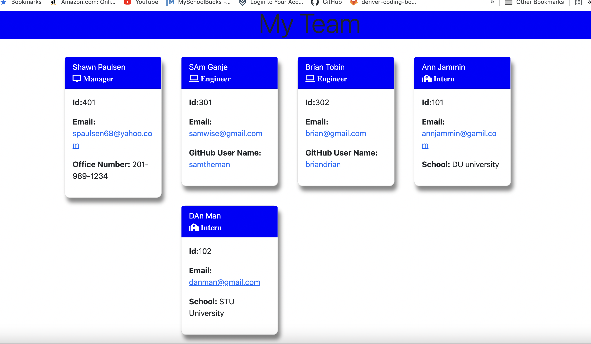

# 10-Object-Oriented-Programming-Team-Profile-Generator

# Description
This is a program designed to add info (from a team) with inquirer that will then be displayed in a html file that is generated from the javascript.  Additionally, npm jest is used to test the code. 

# Usage
Using node index.js generates a series of prompts that are answered from the command line.

# Contributors
There were no direct contributors to this project.  
# Tests
npm run tests  

# Questions
* Feel free to reach out to me with any additional questions.

## License

This application is covered by the MIT license. 

## GitHub username: 
spaulsen-creator 
## Email Adress:
spaulsen68@yahoo.com
## Code:
https://github.com/spaulsen-creator/10-Object-Oriented-Programming-Team-Profile-Generator

## Test Video:

## Deployed app:
No deployed app.